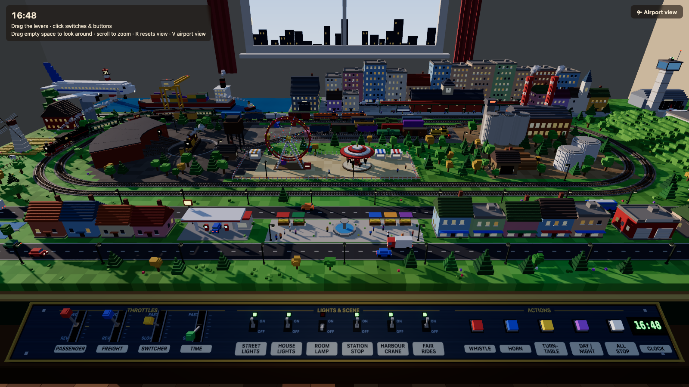

# Voxel Train Yard

An animated HO-scale model railway built in voxel art, seen from the eye height of someone standing at the front of the table. Everything is in one HTML file (`index.html`): Three.js loads from a CDN, and all the models, textures and sounds are made in code.

[](https://coder36.github.io/trainset/)

## ▶ Open it in your browser

**[Launch the train yard](https://coder36.github.io/trainset/)**

The page is hosted on GitHub Pages. You can also click the screenshot above.

## Running it locally

Browsers block ES-module import maps on `file://` pages, so serve the folder locally:

```sh
python3 -m http.server 8000
```

Then open <http://localhost:8000/> in Chrome.

## What's on the layout

- **Main line.** A double-track loop. A steam passenger train runs one way and stops at the station on its own. A freight train with two diesels and a caboose runs the other way.
- **Yard.** Four tracks with a ladder of turnouts and parked freight cars. A small switcher shuttles back and forth.
- **Engine terminal.** A turntable that turns a tank engine, which drives into the roundhouse stalls and under the coaling tower.
- **Harbour.** A container ship, a tug circling it, and moored boats. A gantry crane moves a container between a truck and the ship. There's also a lighthouse whose beam sweeps at night.
- **Towns.** A station with a canopy and clock tower, plus a town behind it with a church and tall blocks. In front there's a road loop with cars, buses and trucks, a gas station, a market square with a fountain, shops and a fire station.
- **Industry and fun.** A factory with smoking chimneys, grain silos, oil tanks, and a lumber yard with a forklift. There's also a fairground with a turning Ferris wheel and carousel.
- **Farm and hill.** A farm with a turning windmill, crop fields and cows, and a wooded hill.
- **Airport extension.** An extra table section bolted to the right end. It has a runway and taxiways, a terminal with jet bridges, a control tower with a rotating beacon, a hangar and a parking lot. An airliner pushes back from its gate, taxis, takes off, flies a circuit over the whole layout, lands and taxis back to its gate.
- **Day and night.** The sun and moon move, and the window shows a changing sky with stars. After dark the street lamps, house windows, headlights, fairground bulbs and runway lights come on, with a soft glow.

## Controls

The controls are physical objects on the front of the table: drag the levers, and click the switches and buttons.

| Main panel | What it does |
|---|---|
| Passenger / Freight levers | Throttle, forward and reverse, with a notch at stop |
| Switcher / Time levers | Yard switcher speed, and how fast time passes |
| Street lights, House lights, Room lamp | Turn each set of lights on or off |
| Station stop, Harbour crane, Fair rides | Turn automatic station stops, the crane and the rides on or off |
| Whistle, Horn | Sound the steam whistle or the diesel horn |
| Turntable | Start the next turntable move |
| Day / Night | Skip ahead to evening or morning |
| All stop | Stop all trains |

| Airport box | What it does |
|---|---|
| Runway lights, Auto flights | Switch the airport lighting and automatic departures |
| Depart | Send the airliner now |
| Layout view | Go back to the main view |

**Camera:** drag empty space to look around, scroll to zoom, press **R** to reset the view, and press **V** (or use the button at top right) to switch between the layout view and the airport view.

## Notes

- Moving vehicles, trains, rides and the airliner all follow paths laid out to keep clear of the scenery. Trees and buildings are kept out of areas that are in use, so nothing passes through anything else.
- A few objects are exposed on `window` for tinkering in the browser console, for example `__SIM.time = 21` to jump to night, or `__FL.request = true` to send the airliner.

## License

Released under the [MIT License](LICENSE).
